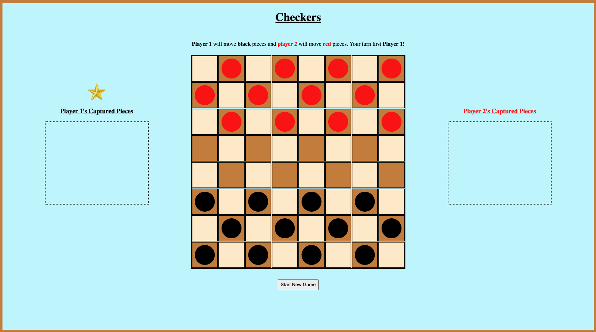
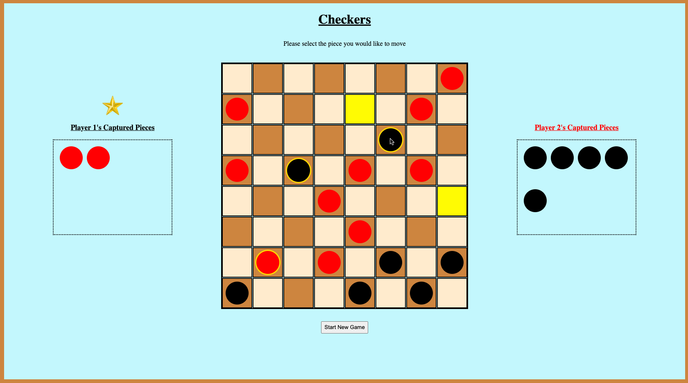
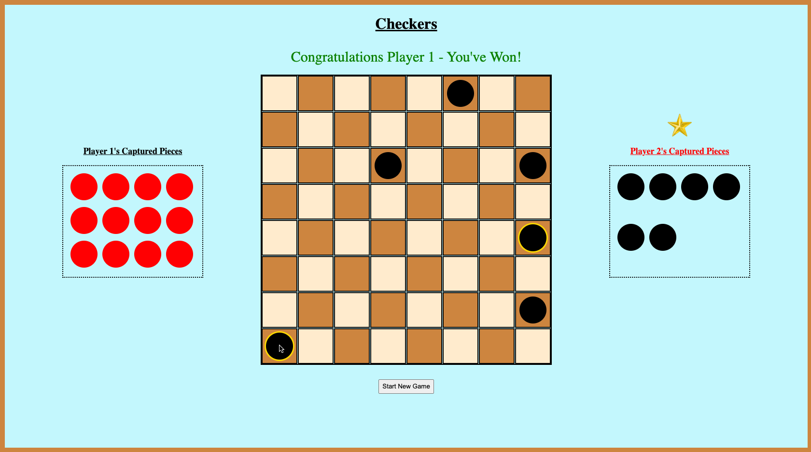

# Checkers

## Description:

A two-player checkers game developed for a General Assembly project

## Technical Requirements

1. Render game in browser
2. Include win/loss logic and render win/loss messages in HTML
3. Include separate HTML, CSS, and JavaScript
4. Use vanilla JavaScript or jQuery
5. Have properly indented HTML, CSS & JavaScript
6. No remaining dead and/or commented out code
7. Code in a consistent manner
8. Deployed online using gitHub

## Technologies Used:

- HTML
- CSS
- JavaScript
- GitHub
- Netlify

## Getting Started:

- [Link to game](https://george-checker-game.netlify.app/)

Instructions:

1. Determine a player 1 & player 2
2. Player 1 selects a black piece to move diagonally towards the top of the screen (player 2 will move a red piece diagonally towards the bottom of the screen)
3. Player 1 chooses the square they wish to move the selected piece to by clicking on a yellow square (representing possible moves)
4. If possible, player 1 must capture a red piece by skipping over that piece to the available square diagonally behind it (will appear yellow)
5. If possible, player 1 must continue to capture pieces after the first jump, so long as there is an available square diagonally behind a red piece (will appear yellow)
6. Once player 1 has moved a single square or captured as many pieces in a row as possible, player 2 begins their turn
7. If any of a player's pieces make it to the opposite end of the board, those pieces become "kings" (represented by a gold ring around the piece) which can then move and capture forward and backward
8. Once a player captures all 12 of their opponent's pieces, the game is over!

## Next steps:

- [Link to Github Repository](https://github.com/georgeperryv/Project-1-Checkers-)
- Incorporate animations to slide pieces when moved or captured
- Render king pieces (i.e., displaying a gold ring) in the captured section when a king is captured
- When "Start New Game" button is clicked, create a pop up asking if the player is sure they want to restart

## Game Screenshots:

Below: Initialize - A screenshot showing the start of a game

Below: Mid-game - A screenshot showing player 2's potential moves for the piece selected

Below: Mid-game - A screenshot showing player 1's potential moves for the king piece selected

Below: Win screen - A screenshot showing player 1's victory!

## Project Hurdles

- One of the most challenging hurdles early on was developing a framework to organize all of the information (i.e., a piece class vs. a board class, creating methods for a class vs. creating independent functions). Once I came up with a way to structure the information by piece through the creation of a piece class, I could easily store attributes such as a piece's square location, its color, whether or not it had moves available, and whether or not it was a king.

- The situation that took the most time to develop an algorithm for was the double+ jump. I wanted to create an algorithm which would allow for consecutive captures infinitely until there were no longer moves available. By adding conditions to the event listner placed on the board, I was able to continually call the showDoubleJumpPosition() method (which would show the available squares) until there were no longer moves available for that piece object.

- Attention to detail was crucial throughout this project as I had to think of every possible scenario someone could move. This would all change if a piece was a king or if an object was on the first or last row of the board. Constantly testing the game to ensure I wasn't missing a possiblity was a very important part of overcoming the bugs I encountered along the way.

## Other sources:

- [Psuedocode Google Sheets Link](https://docs.google.com/document/d/1RDk8BuhwzpKIhrljkslvvc0w8ZBkMTSiJ_EmIBOmAGc/edit?usp=sharing)

- [Wireframe: Game Layout](https://whimsical.com/checkers-WN1B3684nFaXZdqmvkaybh)

- [Checkers Instructions](https://www.wikihow.com/Play-Checkers)

- Sources: Occasionally referenced Stack Overflow, MDN, W3 School, and https://css-tricks.com/snippets/css/complete-guide-grid/

- Image credit: https://encrypted-tbn0.gstatic.com/images?q=tbn:ANd9GcT1pw0j1jDLorNIxhmhT1m3BqOyitKSKbQuGp1-oKI&s
